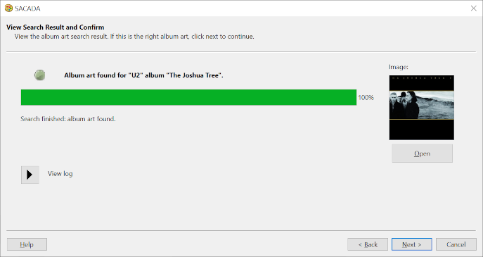
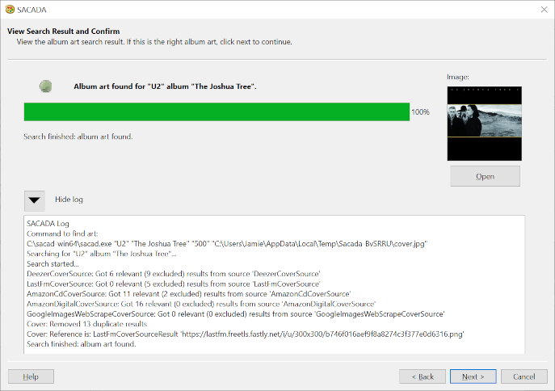

# Sacada

## Overview

Sacada is a GUI front end to a separate command line tool called <a href="https://github.com/desbma/sacad">SACAD</a> (Smart Automatic Cover Art Downloader). SACADA stands for **SACAD** **A**ssistant.

Sacada was specifically written to work with <a href="https://www.foobar2000.org/">foobar2000</a>, but can also be used as a stand-alone GUI for SACAD. Sacada application instructions are on the <a href="https://github.com/Jalopy-Tech/Sacada/blob/master/Sacada.md">Sacada</a> page.

This app rrequires the <a href="https://github.com/desbma/sacad">SACAD</a> command line tool be installed. The image-crunching tools  <a href="http://optipng.sourceforge.net/">optipng</a> and  <a href="http://freshmeat.sourceforge.net/projects/jpegoptim">jpegoptim</a>  can also be optionally installed to allow SACAD to do image crunching. The "sacad" folder containing the "sacad" executable file either needs to be in the search PATH or needs to be a subolder of the Sacada installation folder. Instructions to install both Sacada and the SACAD command line tool in Linux, Windows and macOS are given below. Instructions to add the sacad folder to the search PATH is included. For more information, read the <a href="https://github.com/desbma/sacad">SACAD</a> instructions.

## Screenshots

### Sacada wizard







### Sacada launched from foobar2000


## Installation

### Windows

 In the latest <a href="https://github.com/Jalopy-Tech/Sacada/releases">release</a>, download the executable file "Sacada-Windows-Installer.exe" and run it in Windows. This installer will ask for the destination folder to be created. It defaults to a new folder "C:\Program Files\Sacada". The app can also be installed to a home folder. A shortcut in the Windows start menu under "Sacada" and a desktop shortcut will be created.

To uninstall, go to the Control Panel, then Programs and uninstall Sacada. To uninstall manually, go to the installation folder and run the executable file "SacadaMaintenanceTool.exe".

To install the <a href="https://github.com/desbma/sacad">SACAD</a> command line tool and the <a href="http://optipng.sourceforge.net/">optipng</a> and <a href="https://github.com/XhmikosR/jpegoptim-windows">jpegoptim for Windows</a>  image crunchers: :

1.  Download the WIndows self-extracting archive (sacad_win64.exe) from the  latest <a href="https://github.com/desbma/sacad/releases">SACAD release</a>.  
2.  Run the archive executable to extract the folder "sacad-win64" into an easily accessible location for Windows. e.g. "C:\\" so that the folder is "C:\\sacad-win64".
3.  Download the latest <a href="http://optipng.sourceforge.net/">optipng</a> Windows (32-bit) build zip file. Unzip and copy the optipng.exe file into the sacad-win64 folder made in step 2: "C:\\sacad-win64".
4.   Download the latest <a href="https://github.com/XhmikosR/jpegoptim-windows/releases">jpegoptim for Windows release</a> zip file. Unzip and copy the jpegoptim.exe file into the sacad-win64 fiolder made in step 2: "C:\\sacad-win64".
5.  Press the Windows key and search for "Edit the system environment variables" and open up this Control Panel app.
6.  In the "Advanced" page tab, click the "Environment variables" button.
7.  In the "User variables" for your user section, highlight the "Path" variable and click the "Edit" button.
8.  Click the "New" button and then click the "Browse" button to add a new folder to the path.
9.  Select the folder where you put the extracted "sacad" folder. e.g. "C:\sacad-win64".
8. Log out or restart Windows to allow the new path to be included.

If Sacada installs correctly, it will open displaying a window, waiting for the arist and album to be entered.  If the SACAD command tool is not found, Sacada will display a message window stating so and then close.

If the optipng and jpegoptim crunchers are not found by SACAD when album art is found, two lines will appear in the log results:

```
Main: jpegoptim could not be found, JPEG crunching will be disabled`
Main: optipng could not be found, PNG crunching will be disabled`
```

### macOS

In the latest <a href="https://github.com/Jalopy-Tech/Sacada/releases">release</a>, download the Sacada-macOS-Installer.dmg file and open it in macOS. The image will mount showing the "Sacada-Installer.app". Open this app to run the installer. This installer will ask for the destination folder to be created. It defaults to a new folder ("Sacada") in the user's "Application" folder. A shortcut in Launcher will be created. Note that the program doesn't launch from the installation (it should), but will launch normally from Launcher afterwards.

To uninstall, go to the installation folder using Finder. Run the "Sacada Maintenance Tool.app" app to uninstall.

To install the <a href="https://github.com/desbma/sacad">SACAD</a> command line tool and the <a href="http://optipng.sourceforge.net/">optipng</a> and  <a href="http://freshmeat.sourceforge.net/projects/jpegoptim">jpegoptim</a> image crunchers:, 

1. Open the Terminal app, and enter the following command to install SACAD:

   ```bash
   pip3 install sacad
   ```

2. Note the installation path of sacad, which will be something like "/Users/[user]/Library/Python/3.8/bin" where [user] is macOS login user. 

3.  Open the Terminal app, and enter the following commands to install the optipng and jpegoptim image crunchers:

   ```bash
   brew install optipng
   brew install jpegoptim
   ```

4. The folder from step 2 needs to be in the PATH for the sacad command to be found. The folder ""/usr/local/bin" also needs to be in the PATH for the optipng and jpegoptim image crunchers to be found.. These two paths need to be added to the PATH, but first list the current PATH using the Terminal command:

   ```bash
   launchctl getenv PATH
   ```

4. This will probably be empty, but If not, note these initial PATH(s).

5. Run a Terminal command to include the initial paths + two new paths .

   If there were no initial PATHs noted in step 5, run the Terminal command (root password required). e.g.:

   ```bash
   sudo launchctl config user path /usr/local/bin:/Users/[user]/Library/Python/3.8/bin
   ```

   OR

   If initla PATHs were noted in step 5, they should also be included separated by a colon ":" (root password required). e.g. the initial path was /usr/bin, then run the Terminal command:

   ```bash
   sudo launchctl config user path /usr/bin:/usr/local/bin:/Users/[users]/Library/Python/3.8/bin
   ```

7. Reboot macOS for the changes to take effect.

If Sacada installs correctly, it will open displaying a window, waiting for the arist and album to be entered.  If the SACAD command tool is not found, Sacada will display a message window stating so and then close.

lf the optipng and jpegoptim crunchers are not found by SACAD when album art is found, two lines will appear in the log results:

   ```
   Main: jpegoptim could not be found, JPEG crunching will be disabled`
   Main: optipng could not be found, PNG crunching will be disabled`
   ```

### Linux

In the latest <a href="https://github.com/Jalopy-Tech/Sacada/releases">release</a>, download the executable file "Sacada-Linux-Installer.run" and run it in Linux. This installer will ask for the destination folder to be created. It defaults to a new folder ("sacada") in the home folder. The app can also be installed to a root folder such as "/opt/sacada" as desired (root password will be needed).. The app files will be installed and a shortcut will be added to the menu under "Other". The app can be run directly using the "sacada.sh" file in the installation folder.

To uninstall, go to the installation folder and run the executable file "adb-wireless-connect-maintenance-tool".

To install the <a href="https://github.com/desbma/sacad">SACAD</a> command line tool and the <a href="http://optipng.sourceforge.net/">optipng</a> and  <a href="http://freshmeat.sourceforge.net/projects/jpegoptim">jpegoptim</a> image crunchers:

1. Open a terminal, and enter the following commands:

   ```bash
   sudo apt install sacad
   sudo apt install optipng jpegoptim
   ```

2. The sacad command should be in the PATH automatically which will be something like "/home/[user]/.local/bin/sacad". If it isn't, add to the path using the .profile file.

If Sacada installs correctly, it will open displaying a window, waiting for the artist and album to be entered.  If the SACAD command tool is not found, Sacada will display a message window stating so and then close.

lf the optipng and jpegoptim crunchers are not found by SACAD when album art is found, two lines will appear in the log results:

   ```
Main: jpegoptim could not be found, JPEG crunching will be disabled`
Main: optipng could not be found, PNG crunching will be disabled`
   ```

### WINE in Linux

In Linux, it is recommended to install and run Sacada as a native application (see Linux section above) even if using in conjunction with a WINE application such as foobar2000. However, Sacada can be installed under WINE to run as a Windows application if necessary.

In the latest <a href="https://github.com/Jalopy-Tech/Sacada/releases">release</a>, download the executable file "Sacada-Windows-Installer.exe" and open it with WINE. This installer will ask for the destination folder to be created  and it may default to an unusable folder such as "/Sacada". This needs be changed to a new folder such as "C:\Program Files\Sacada". The app can also be installed to a home folder. In the Linux menu, a shortcut menu item under "Wine" will be created.

To uninstall, go to the installation folder and run the executable file "SacadaMaintenanceTool.exe" and open it with WINE. The installation folder will be in the WINE folder structure. For example "/home/[user]/.wine/drive_c/Program Files/Sacada" where [user] is the Linux user's home folder in which WINE is installed.

To install the <a href="https://github.com/desbma/sacad">SACAD</a> command line tool :

1.  Download the Windows self-extracting archive (sacad_win64.exe) from the  latest <a href="https://github.com/desbma/sacad/releases">SACAD release</a>.

2. Run the archive executable in WINE to extract the folder "sacad-win64" into an easily accessible location for Windows. such as "C:\\" so that the folder is "C:\\sacad-win64".

    OR

    Extract the folder in Linux and copy the "sacad-win64" folder to /home/[user]/.wine/drive_c/sacad-win64 where [user] is the Linux user under which WINE is installed.

2. Download the latest <a href="http://optipng.sourceforge.net/">optipng</a> Windows (32-bit) build zip file. Unzip and copy the optipng.exe file into the sacad-win64 folder made in step 2. If copying within Linux, the folder is "/home/[user]/.wine/drive_c/sacad-win64" where [user] is the Linux user under which WINE is installed.

4.  Download the latest <a href="https://github.com/XhmikosR/jpegoptim-windows/releases">jpegoptim for Windows release</a> zip file. Unzip and copy the jpegoptim.exe file into the sacad-win64 fiolder made in step 2.  If copying within Linux, the folder is "/home/[user]/.wine/drive_c/sacad-win64" where [user] is the Linux user under which WINE is installed.

3. When using WINE, the Windows PATH can be set using the Linux environment variable WINEPATH. Add the following line to your .profile file:

    `export WINEPATH="c:\\sacad-win64"`

   (note the double backslashes are needed to designate a single backslash character)

If Sacada installs correctly, it will open displaying a window, waiting for the artist and album to be entered.  If the SACAD command tool is not found, Sacada will display a message window stating so and then close.

lf the optipng and jpegoptim crunchers are not found by SACAD when album art is found, two lines will appear in the log results:

   ```
Main: jpegoptim could not be found, JPEG crunching will be disabled`
Main: optipng could not be found, PNG crunching will be disabled`
   ```

## Compiling Sacada from Source

To compile from source, <a href="https://www.qt.io/">QT</a> Community Edition version 6.8.2 (or newer) needs to be installed on the relevant platform. All source code is stored in the "source" folder including the sacada.pro file which can be opened by the QT Creator app. Building in QT Creator or using qmake will create a executable file without dependencies added. It is recommended to set the build folder to "../builds" in order to build the executable in a folder expected by the packagers mentioned below.

An installer including dependencies can be packaged using the set up files in the folder "packagers". There is a folder with a packager script for each platform. Run the relevant packager script which will be named "Sacada-[platform]-Packager.[ext]". The packager will create an installer in the same folder. This installer is a single executable file which will install the application on the target platform with all dependencies included. The packager script may need the paths adjusting if the QT utilities are not in the expected paths.

## License

Copyright &copy; 2025 Robert J. Joynt.

The <a href="https://github.com/Jalopy-Tech/Sacada/blob/master/LICENSE.md">Sacada license</a> uses the <a href="https://www.qt.io/">QT</a> GPLv3 <a href="https://doc.qt.io/qt-5/gpl.html">Open Source License</a>

## Contact

For further inquires, please email: robertjjoynt@gmail.com .


